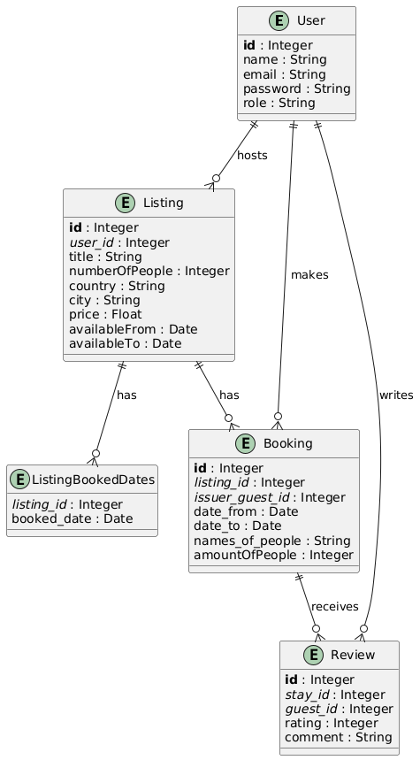

# ShortTermStayCompanyAPI
https://stsc-a3hefkewerhsfads.uaenorth-01.azurewebsites.net

A RESTful API for a fictitious short-term stay company similar to Airbnb. This API allows hosts to manage property listings and guests to search, book stays, and provide reviews. Administrators can generate reports on listings and manage the platform.

---

## Table of Contents
- [API Documentation / Deployment](#api-documentation--deployment)
- [Video Presentation](#video-presentation)
- [Introduction](#introduction)
- [For Hosts](#for-hosts)
- [For Guests](#for-guests)
- [For Admins](#for-admins)
- [Technology Stack](#technology-stack)
- [Data Model](#data-model)
- [Design, Assumptions, and Issues](#design-assumptions-and-issues)

---

## API Documentation / Deployment

Access the (Swagger UI) API documentation:

- **Azure Deployment**:[https://stsc-a3hefkewerhsfads.uaenorth-01.azurewebsites.net/swagger](https://stsc-a3hefkewerhsfads.uaenorth-01.azurewebsites.net/swagger)

---
## Video Presentation

Watch the Project Presentation: https://www.youtube.com/watch?v=ZpksoAENmN0

---
## Introduction

This project is developed as part of the SE 4458 Software Architecture & Design of Modern Large Scale Systems course. It fulfills the requirements of the midterm project.

### For Hosts:
- **Insert Listings**: Hosts can create new property listings by providing details such as the number of people it can accommodate, location, and price.

### For Guests:
- **Query Listings**: Guests can search for available listings based on date range, location, and number of people. Listings that are fully booked for the specified dates are excluded.
- **Book a Stay**: Guests can book available listings for specific dates.
- **Review a Stay**: After completing a stay, guests can leave a review with a rating and comment.

### For Admins:
- **Report Listings with Ratings**: Admins can generate reports of listings filtered by country and city, including average ratings and review counts.

---

## Technology Stack

- **Backend Framework**: Flask (Python)
- **Database**: Microsoft SQL Server on Azure
- **Authentication**: JWT (JSON Web Tokens)
- **API Documentation**: Swagger (OpenAPI Specification)
- **Deployment**: Azure App Service

---

## Data Model
### Entity-Relationship Diagram (ERD)

#### **User**:
- **Attributes**: `id`, `name`, `email`, `password`, `role` (guest, host, admin)
- **Relationships**:
  - Hosts have many Listings.
  - Guests have many Bookings and Reviews.

#### **Listing**:
- **Attributes**: `id`, `user_id`, `title`, `numberOfPeople`, `country`, `city`, `price`, `availableFrom`, `availableTo`
- **Relationships**:
  - Belongs to a User (Host).
  - Has many Bookings.
  - Has many Reviews through Bookings.

#### **Booking**:
- **Attributes**: `id`, `listing_id`, `issuer_guest_id`, `date_from`, `date_to`, `names_of_people`, `amountOfPeople`
- **Relationships**:
  - Belongs to a User (Guest).
  - Belongs to a Listing.
  - Has one Review (for each unique stay).

#### **Review**:
- **Attributes**: `id`, `stay_id`, `guest_id`, `rating`, `comment`
- **Relationships**:
  - Belongs to a Booking.
  - Belongs to a User (Guest).

---

## Design, Assumptions, and Issues

### **Design Decisions**
- **RESTful API Structure**: The API follows REST principles.
- **API Versioning**: All endpoints are prefixed with `/v1/` to allow future versioning.
- **Role-Based Access Control**: Implemented using decorators to restrict access to endpoints based on user roles (guest, host, admin).
- **JWT Authentication**: Secure endpoints using JWT tokens to authenticate and identify users.

### **Assumptions**
- **Default Values**: For optional fields not provided in requests, default values are used (e.g., `amountOfPeople` defaults to 1).
- **Data Validation**: Basic validation is performed on inputs (e.g., date formats, required fields).
- **Booking Constraints**: A listing cannot be booked if it is fully booked for the specified dates.
- **Email Uniqueness**: Each registered user must have a unique email address.
- **Primary Key-Based IDs**: APIs return the primary keys of their respective models. 

### **Issues Encountered**
- **Date Handling**: Managing date availability and conflicts in bookings.
- **Pagination Implementation**:
- **Role Enforcement / Token Management**: Ensuring that only users with the appropriate role could access certain endpoints 
